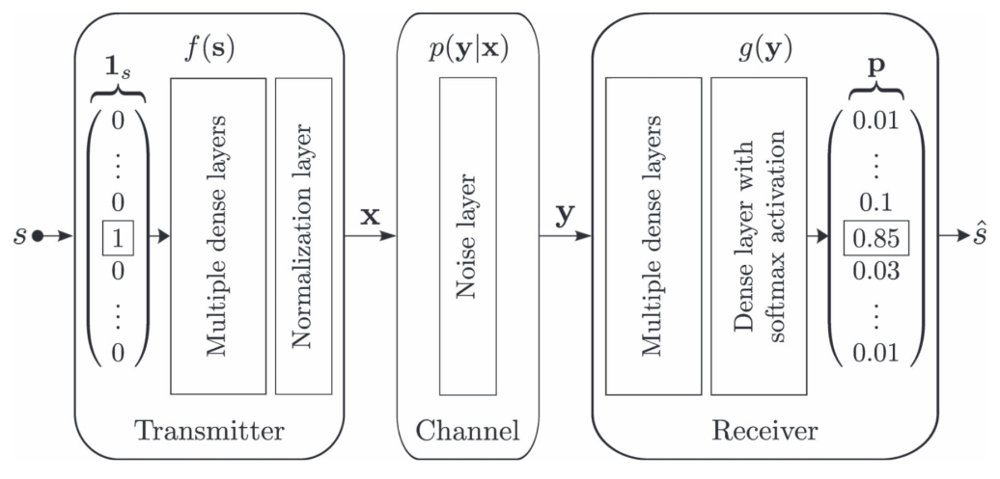

# ML-DL-Auto-Encoder

## Description 

"Communications is a field of rich expert knowledge about how to model channels of different types, compensate for various hardware imperfections, and design optimal signaling and detection schemes that ensure a reliable transfer of data. As such, it is a complex and mature engineering field with many distinct areas of investigation which have all seen diminishing returns with regards to performance improvements, in particular on the physical layer. Because of this, there is a high bar of performance over which any machine learning (ML) or deep learning (DL) based approach must pass in order to provide tangible new benefits. In domains such as computer vision and natural language processing, DL shines because it is difficult to characterize real world images or language with rigid mathematical models. For
example, while it is an almost impossible task to write a robust algorithm for detection of handwritten digits or objects in images, it is almost trivial today to implement DL algorithms that learn to accomplish this task beyond human levels of accuracy. In communications, on the other hand, we can design transmit signals that enable straightforward algorithms for symbol detection for a variety of channel and system models (e.g., detection of a constellation symbol in additive white Gaussian noise (AWGN)). Thus, as long as such models sufficiently capture real effects we do not expect DL to yield significant improvements on the physical layer."
Subject from: https://arxiv.org/pdf/1702.00832.pdf

The objective of this project was to replicate a communication system over an AWGN channel represented as an Auto-Encoder and compare these results in the form of a constellation or linear representation with a M-PSK (Phase-Shift Keying) system. 

    
* `s`: Input encoded as an One-Hot Vector  
* `x` : Complex Symbol, a vector of size 2  
* `y = x + Noise`: Complex Symbol, a vector of size 2
* `ŝ`: Output, Probability distribution over all possible messages, from which the most probable one is chosen

For the data in the form of `s`, a tensor of size `100 000x2^k`, where each row is randomly generated as a one-hot vector, is created.

## Requirement

Having Python3 and Pip installed on your machine.

## Execution 

### On Ubuntu:

To execute a .sh Script:  
   1. Open a terminal.  
   2. Run the command `chmod +x script_name.sh` to make the script executable.  
   3. Execute the script by running `./script_name.sh`.  

#### Execute Project.sh  

1. Import Required Libraries:
    * Numpy
    * Torch
    * Matplotlib

2. Running the main.py file:
    1. Create the data `s` in `tensor`.
    2. Create the Auto-Encoder and launch the training and testing phase.
    3. Compare the constellation of the learned model and the M-PSK.
    4. If `k=3`, display the linear comparison between the curve of the learned model and that of the M-PSK.

### On Windows:

*Under construction for running .sh scripts.*  
main.py can be executed on IDEs like PyCharm by importing Numpy, Torch and Matplotlib

## Contact Information

 For inquiries or feedback, please contact Alexis EGEA at [alexisegea@outlook.com](mailto:alexisegea@outlook.com).

## Copyright

© 2024 Alexis EGEA. All Rights Reserved.
